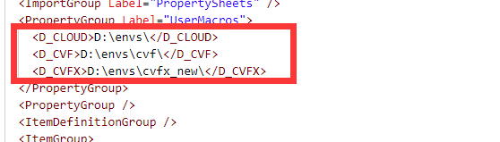
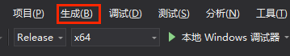
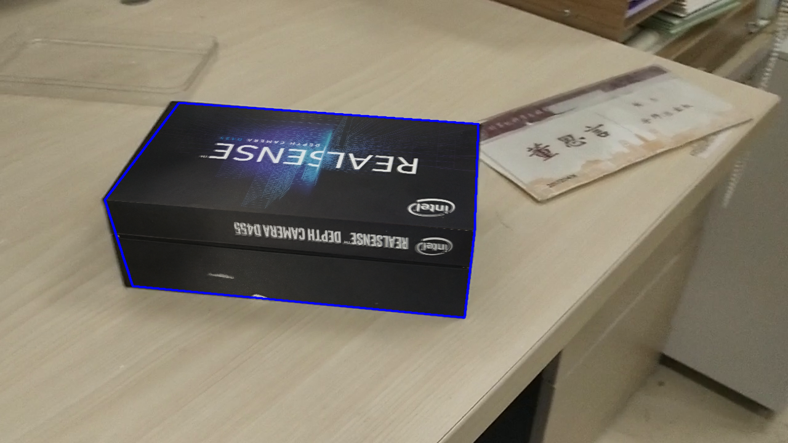
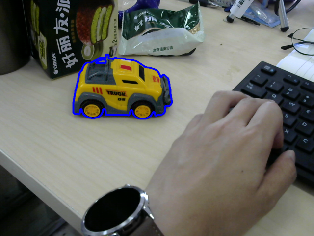
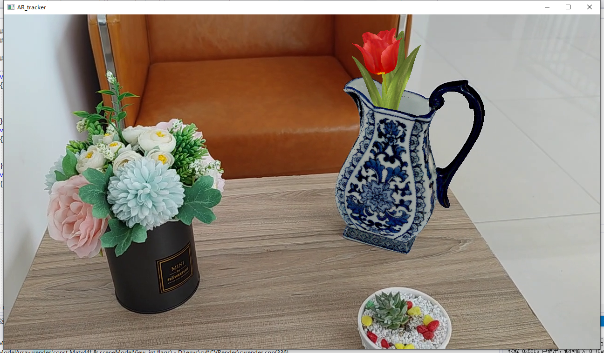
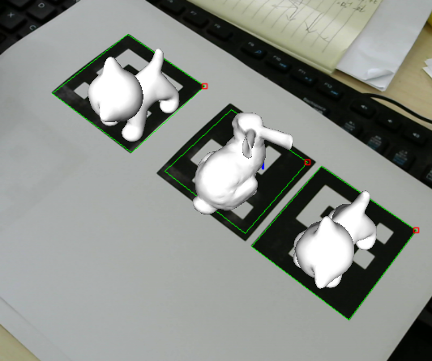
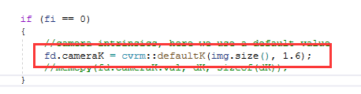
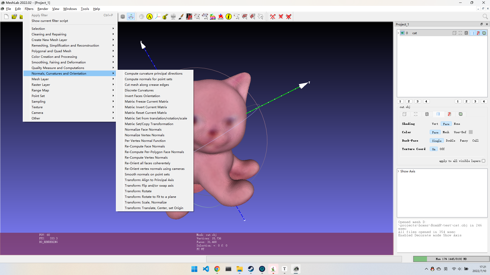

# 第0章 环境配置

> **建议进行配置运行步骤之前，先浏览一遍本说明文档，已经有很多问题在说明文档中提及。**
>
> 以下配置过程基本环境：
>
> ​	Windows + VS2019（或VS2019 SDK）
>

**1.BoxAR相关环境及测试模型、视频下载**：[Google Drive](https://drive.google.com/drive/folders/1lGiHSgc9MeI_1BP4acF2jiftR4JKuJ7t?usp=sharing)

**2.BoxAR代码下载**

使用`git clone`命令并`git checkout vr2024`切换到**vr2024分支**

**3、文件组织结构**

将云盘中的压缩包解压后排布路径如下所示

**请不要包含中文路径**

由于第三方库采用相对路径，请不要随意修改文件位置关系

```
Path/ 
    BoxAR/
        BoxAR.sln
        BoxAR
        README.md
        ...
    cvf/
    cvfx_new/
    data/
    glad/
    glfw-3.3.4.bin.WIN64/
```

- BoxAR是我们的主体项目

- cvf中封装了本项目中使用到的一些函数

- cvfx包含了opencv及常用的第三方库

- data中给出了我们的一些模型数据

   将data中的数据解压至此

- glad和glfw是方便同学们渲染扩展而使用的opengl库


**4.配置CVF/CVFX**

- 使用文本编辑器打开local.props，修改D_CVF和D_CVFX为本地路径的绝对路径（PATH/CVF和PATH/CVFX）
- 请保证修改完毕后重新打开.sln项目




打开local.h

修改一下路径

```
#define TMPDIR    std::string(" /path/to/output/")
#define INPUTDIR  std::string("/path/to/data")
```

第一个目录是输出缓存文件位置，第二个设置为data数据所在目录

**请不要随便修改local.props之外的项目配置**

**5、构建项目**

**注意：目前仅配置了x64/release，如果需要跟踪调试，可以在release模式下禁用优化重新编译**

在release x64模式下生成项目，成功后你将在BoxAR.sln 同级目录下看到一个x64文件夹



最后，在项目属性设置里设置PATH=$(D_PATH)，示例：


# 第一章 总体流程

本章节中 你将对我们整个项目有所了解 ，请确保你可以跑通我们给出的所有示例代码。 

- 制作长方体模型
- 标定相机内参
- 在离线视频或实时视频中跟踪生成模型，得到位姿
- 以被跟踪模型为定位，实现想要的AR效果

我们执行不同模块代码，可以通过修改main.cpp的内容实现，其中

**跟踪和渲染**

- `exec("test_3d_tracking");`测试跟踪算法
- `exec("test_ardetectors");`测试AR效果

**无纹理物体的跟踪**

- `exec("model.select_init_pose");`  生成模型初始位姿
- `exec("test_manual_init");`

**aruco跟踪渲染**

- `exec("test_create_aruco_dict");`  生成aruco标记
- `exec("test_aruco_ar");`  aruco跟踪

**工具**

- `exec("tools.gen_box_model");`生成长方体模型
- `exec("tools.calib_camera");`执行相机标定

这些执行函数分别在

```
test/test_trackers.cpp

test/testaruco.cpp

test/test_trackers2.cpp


tools/calibration.cpp

tools/gen_box_model.cpp
```

中实现

并且以 如下形式注册以在main中使用

```
CMD_BEG()
CMD0("name", function_name)
CMD_END()
```


# 第二章  跟踪算法

## 2.1 跟踪一个物体

在main.cpp中选择`exec("test_3d_tracking")`执行，跟踪算法的测试函数在test_tracker.cpp中，核心算法在core文件夹中。

在test_tracker.cpp中的test_detectors()函数中更改`modelFile`和`videoFile`变量可以选择待跟踪物体模型和测试视频。如果你无法正确加载模型，我们建议采用绝对路径方式试试看。




## 2,2 无纹理物体跟踪

在main.cpp中选择`exec("test_manual_init")`执行，跟踪算法的测试函数在test_tracker.cpp中。

值得注意的是，由于物体纹理稀少，我们需要给定模型的初始位姿，在代码相应片段提示应运行`exec("model.select_init_pose");`  以获取初始位姿并填入对应位置后才能保证具有好的效果。



## 2.3 AR渲染

实现AR效果需要将一个虚拟物体渲染到图像上，跟踪是为了实时获取传感器位姿，并利用该位姿渲染虚拟物体，所以整个过程需要的是：

- 被跟踪物体：在视频中真实出现的物体，并且有该物体的模型文件
- 待渲染物体：用来实现虚实融合效果的物体，在视频中并不真实存在，只需要有该物体的模型文件即可

如果要在跟踪的基础上通过渲染实现简单的AR效果，需要在main.cpp中选择执行`exec("test_ardetectors");`其测试函数在test_trackers2.cpp中，其中有简要的注释，可以根据注释修改代码中的一些路径（包括被跟踪模型文件、测试视频、待渲染物体文件等）。

生成视频的效果如下图所示，其中花为渲染合成到原始图像的模型，你可以通过选择自己的测试视频、被跟踪模型、被渲染模型实现更高级的AR效果。

**请仔细研读本节的代码，后续你可以基于此做出更加酷炫的渲染**



# 第三章 

本章节使用到了aruco的相关数据 

和data/test.zip中的一些无纹理模型

[aruco是什么？](https://blog.csdn.net/dgut_guangdian/article/details/107814300)

`exec("test_create_aruco_dict")` 生成了纸面上的aruco 。你可以将输出的文件放到一个word中打印出来。

`exec("test_aruco_ar")`可以执行跟踪这些码，然后在上面渲染了一些物体如下所示。

**请仔细研读本节的代码，后续你可以基于此做出更加酷炫的渲染**



# 第四章 制作模型

前面章节使用了我们给出来的一些模型和视频文件。

本章节开始我们将使用自己的模型和摄像头之前的跟踪和渲染工作

## 4.1制作一个长方体模型

### 4.1.1 准备工作

1.准备模型

要求：

- 具有充足的纹理特征（图案信息要丰富） （Tips：可以用笔画画）
- 每个面尽量不相同  （Tips：也可以用笔画一下）
- 不易发生形变 （坏例子： 非常容易形变的快递盒）

2.创建目录

如上图，首先在`INPUTDIR`目录下创建两个文件夹

- images 用来存放图片
- model 用来存放模型文件

### 4.1.2 模型放置与图片拍摄

首先你需要在现实中找到一个长方体盒子

**将你打算要制作的长方体模型想象在右手空间坐标系下按照长边贴近的原则摆放**，

这样y轴方向是长 x轴方向是宽 z轴方向是高

**记录你的模型的长宽高 单位： 毫米(mm)**


我们想象将其表面展开如下图所示，随后需要按照一定的顺序进行拍摄（否则程序就不知道哪张图应该贴到盒子的什么位置:) )


将模型进行展开可以得到上图，接下来按照图片中的标号对物体进行拍并将其放到 ./images目录下，并按照刚刚的序号进行重命名，你应该得到如下的六张图片：


### 4.1.3模型生成代码

1. 依次按照提示输入长、宽、高（mm）

2. 按照顺时针方向依次对六张图片选定模型的四个点，然后点击**回车**键预览切片效果，再次**回车**进入下一张图片选择。如下图

   

3. 结束后应该在model目录下得到三个文件

   

4. 使用[MeshLab](https://en.softonic.com/download/meshlab/windows/post-download) 查看模型

## 4.2 相机内参获取

在程序中我们使用了默认的相机内参，如下图所示，其中参数1为图像尺寸，参数2为焦距和图像高度之比。

**为什么需要我自己去测量相机内参：**

也许使用你的摄像头跟我们给出的默认摄像头有所偏差。 如果你觉得你录制的视频的追踪效果与我们的偏差较大，不妨继续阅读。**当然也可以选择暂时跳过这部分。**

为了获取准确的内参，请使用本节说明进行相机的标定。




我们在代码中使用了opencv自带的张氏标定法的例子

如果你想了解原理与具体的操作，可以查看[opencv 的官方链接](https://docs.opencv.org/4.x/d4/d94/tutorial_camera_calibration.html)

这里我们对配置部分做简单的介绍

### 打印标定板

将所给图片用彩色打印机打印 或直接在电脑或iPad上用图片显示


### 运行代码

- 选择1：拍摄一段视频
- 选择2：使用摄像头

分别在tools\calibration.cpp 中修改选择你的模式并按照提示修改路径。

请注意：**此处的默认宽和高均为7，计算方式为你打印的标定板宽/高方向上黑白色格子的总数-1。请检查你的标定板，若不同请做出修改**


我们代码中采用了相对路径，默认读取视频和存放结果在`INPUTDIR`下

在项目main函数中 执行exec("tools.calib_camera"); 即可运行代码


**要求：**

1、不宜过长，10几秒的视频即可

2、移动标定板或者移动相机

3、角度尽量要多

4、**（很重要）保证标定板在你的视频中始终是完全出现的，不要出现遮挡和拍摄不全的情况**

在视频/摄像头模式下按g进行标定，总共进行20张图片的截取，当右下角提示calibration后即可退出或等待视频完毕。

 标定结束后，会在`INPUTDIR`目录下找到 camera.yml文件

其中，如图所示部分为所需的内参矩阵 找到camera_matrix的data部分 将其reshape成一个3x3的矩阵


接下来依次将你获得的data 替换掉下图对应前面章节的追踪部分代码的dk[]  并将cameraK替换成注释代码即可。

```

float dK[] = {
		1.324595302424838110e+03, 0.000000000000000000e+00, 6.460060955956646467e+02,
		0.000000000000000000e+00, 1.330463970754883576e+03, 3.568279021773695945e+02,
		0.000000000000000000e+00, 0.000000000000000000e+00, 1.000000000000000000e+00
	};
	
fd.cameraK = cvrm::defaultK(img.size(), 1.5);
//memcpy(fd.cameraK.val, dK, sizeof(dK));
```


# 第五章 扩展方向

仓库里的代码仅仅实现了一个非常简单的demo生成。

我们希望你能根据我们给出的示例程序制作更加酷炫的AR场景。

具体的，我们希望你能像第一章中写一个新函数，在我们给出的代码基础上做出一些改进。

可改进的方向包括但不限于：

- 发挥想象，设计更高级的AR场景  例如切换一些跟踪物体的皮肤
- 交互  例如鼠标单击 做出某些反应
- 跟换实时性更好的跟踪算法
- ……


### 其他说明

#### Meshlab可视化调整模型

如果使用其他的模型没法得到预想的效果，可能是因为待跟踪物体模型和渲染合成模型之间的坐标系存在较大差异，可以使用meshlab进行调整（或者写一段读取obj文件直接修改的代码），如果使用meshlab，打开一个obj文件：


在下图所示菜单选项中的Transform项可以缩放、平移、旋转模型



#### 视频导出

如果需要将渲染后的视频导出，可以搜索VideoWriter的使用方法，代码中也有一定的注释说明

# FAQ

1、如何使用wifi？

请自行搜索eduroam 本学校相关的政策

2、无法打开***.dll的情况？

是否按照第0章 正确配置D_PATH？

另外，最简单的方式是将cvfx中对应的dll文件复制到第0章提到的项目文件x64的相同文件夹中

3、编译过程中，如果出现找不到***.lib的情况

在项目属性->链接器->常规->附加依赖项中把cvfx中对应lib文件的路径添加进去

4、运行过程中，如果出现filesystem异常的情况，则对应修改modelFile和videoFile变量

**我们建议采用绝对路径试试看**

5、配置过程中如果遇到“pop_t：未声明的标识符”，可以参照[链接](https://blog.csdn.net/DLW__/article/details/122329784)修改

6、请确保构建中没有vcpkg以及其他版本opencv4的影响，不然会有冲突
