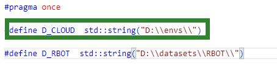
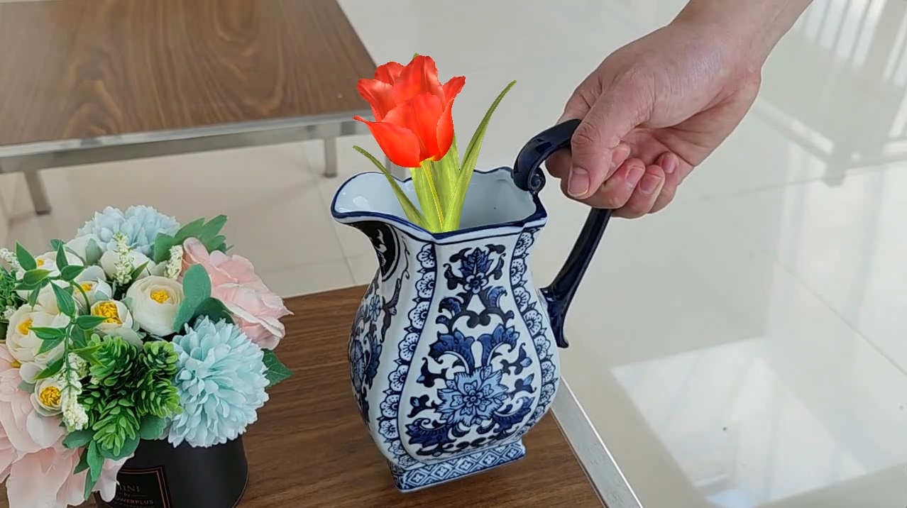

# 基本配置说明

> 以下配置过程均需要在VS2019中（或VS2019 SDK）进行
## CVF/CVFX下载及配置

1.CVF下载

从以下地址获取CVF，解压到任意路径，假设为PATH/CVF

> https://github.com/cvbubbles/cvf

2.CVFX下载

从志愿者提供的链接中下载cvfx.zip，解压到任意路径，假设为PATH/CVFX

3.BoxAR代码下载

使用git clone命令或者下载zip文件将代码从仓库复制到本地

4.配置CVF/CVFX

- 使用文本编辑器打开local.props，修改D_CVF和D_CVFX为本地路径（PATH/CVF和PATH/CVFX）,D_CLOUD可以不修改，示例：

- 打开local.h，将D_CLOUD设置为CVF和CVFX的上层目录（PATH），示例：

  

- 如果运行时提示找不到dll，在项目属性设置里设置PATH=$(D_PATH)，示例：

- 正常情况下配置后可以编译运行代码，为了便于代码在不同机器上运行，请不要随便修改local.props之外的项目配置
- 注意：目前仅配置了x64/release，如果需要跟踪调试，可以在release模式下禁用优化重新编译
- 配置过程中如果遇到“pop_t：未声明的标识符”，可以参照[链接](https://blog.csdn.net/DLW__/article/details/122329784)修改

## GLAD和GLFW配置

1.GLAD下载

到[GLAD官网](http://glad.dav1d.de/) 下载glad.zip，示例：

解压glad.zip，得到include和src两个文件夹

2.GLFW下载

在仓库的glfw文件夹中有glfw.zip，解压到任意路径

3.GLAD和GLFW配置

在项目属性页VC++目录的包含目录中导入glad解压得到的include文件夹，将src文件夹中的glad.c添加到项目中

导入include文件夹示例：

将glad.c添加到项目示例：

在项目属性页VC++目录的库目录中导入glfw解压后得到的lib-vc2019文件夹所在路径，示例：

在项目属性页->链接器->附加依赖项中加入glfw3.lib，示例：

## 3D模型和测试视频

# 长方体模型生成

## 准备工作

1.准备模型

要求：

- 具有充足的纹理特征（图案信息要丰富） （Tips：可以用笔画画）
- 每个面尽量不相同  （Tips：也可以用笔画一下）
- 不易发生形变 （坏例子： 非常容易形变的快递盒）

2.创建目录

如上图，在BoxAR目录下创建两个文件夹

- images 用来存放图片
- model 用来存放模型文件

## 模型放置与图片拍摄

测量模型的长宽高 单位： 毫米(mm)

要求在右手空间坐标系下按照长边贴近的原则摆放

随后需要按照一定的顺序进行拍摄（否则程序就不知道哪张图应该贴到盒子的什么位置:) )

将模型进行展开可以得到上图，接下来按照图片中的标号对物体进行拍并将其放到 ./images目录下，并按照刚刚的序号进行重命名，你应该得到如下的六张图片：

## 模型生成代码

1. 依次按照提示输入长、宽、高（mm）

2. 按照顺时针方向依次对六张图片选定模型的四个点，然后点击回车键进入下一张图片选择。如下图

   

3. 结束后应该在model目录下得到三个文件

   

4. 使用[MeshLab](https://en.softonic.com/download/meshlab/windows/post-download) 查看模型

## 相机内参获取

我们在代码中使用了opencv自带的张氏标定法的例子

如果你想了解原理与具体的操作，可以查看[opencv 的官方链接](https://docs.opencv.org/4.x/d4/d94/tutorial_camera_calibration.html)

这里我们对配置部分做简单的介绍

### 打印标定板

将所给图片用彩色打印机打印 或直接在电脑或iPad上用图片显示

### 运行代码

- 选择1：拍摄一段视频
- 选择2：使用摄像头

分别在BoxAR\tools\calibration.cpp 中修改选择你的模式并按照提示修改路径。

请注意：**此处的默认宽和高均为7，计算方式为你打印的标定板宽/高方向上黑白色格子的总数-1。请检查你的标定板，若不同请做出修改**

在项目main函数中 执行exec("tools.calib_camera"); 即可运行代码

**为什么选用视频/摄像头：**

对于市面上的手机而言，视频模式和拍照模式的分辨率等属性不是一致的。由于后续的检测和跟踪中需要你去拍摄一段视频，所以我们要保证在这里检测到的相机参数是一致的。

**要求：**

1、不宜过长，10几秒的视频即可

2、移动标定板或者移动相机

3、角度尽量要多

4、**（很重要）**保证标定板在你的视频中始终是完全出现的，不要出现遮挡和拍摄不全的情况

在视频/摄像头模式下按g进行标定，总共进行20张图片的截取，当右下角提示calibration后即可退出或等待视频完毕。

 标定结束后，会在/BoxAR 目录下找到 camera.yml文件

其中，如图所示部分为所需的内参矩阵

# 跟踪算法及AR渲染

**Attention : 将代码的redist_replace文件夹中的两个文件替换CVF路径下re3d/utils路径下的对应文件**

## 跟踪算法

如果要使用单独的跟踪算法，在main.cpp中选择exec("test_detectors")执行，跟踪算法的测试函数在test_tracker.cpp中，核心算法在core文件夹中。在test_tracker.cpp中的test_detectors()函数中更改modelFile和videoFile变量可以选择待跟踪物体模型和测试视频。

通过更改下图所示路径可以设置当前目录：

如果之前的CVF/CVFX配置已经正确完成，在VS2019中运行，会得到类似下图所示结果

## AR渲染

如果要在跟踪的基础上通过渲染实现简单的AR效果，需要在main.cpp中选择执行exec("test_ardetectors");

其测试函数在test_trackers2.cpp中，其中的路径修改方法与test_trackers.cpp中的相同

如果之前GLAD/GLFW配置以经完成，运行代码后会在程序所在文件夹生成一段演示视频，其路径可按照需求在test_trackers2.cpp中的下图位置修改

需要注意的是，推荐导出视频格式为avi，在上图中的Size设置时注意与要生成视频的图片保持相同。

要更改渲染的模型，可以在test_trackers2.cpp的obj_path变量处修改

生成视频的效果如下图所示，其中花为渲染合成到原始图像的模型，你可以通过选择自己的测试视频、被跟踪模型、被渲染模型实现更高级的AR效果

# 渲染代码说明

渲染代码主体来自[learnOpenGL](https://learnopengl-cn.github.io/)，各函数功能可参考该教程

# 可实现的功能

仓库里的代码仅仅实现了一个非常简单的demo生成，你可以在此基础上进行修改从而实现更高级的AR效果，可改进的方向包括但不限于：

- 发挥想象设计更高级的AR场景
- 实现一个实时的AR场景
- 加入交互
- 改进渲染部分
- 改进跟踪算法
- ……
